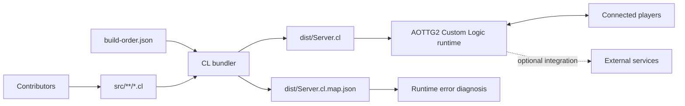
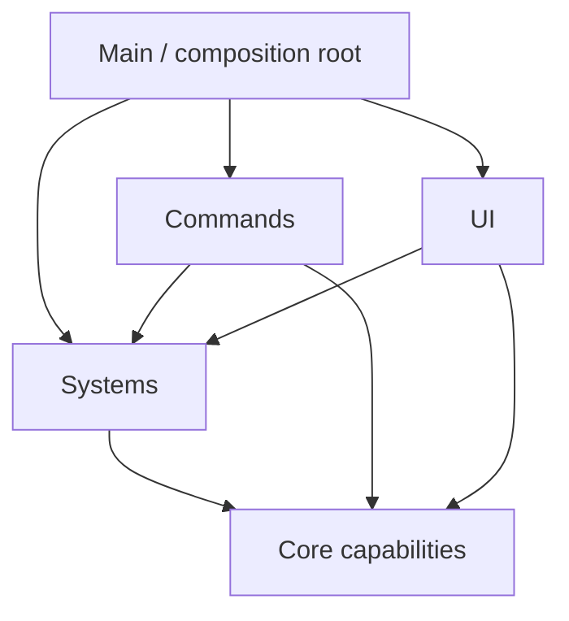

# Architecture

## Purpose

This document defines the structural model of the project: how modular source becomes one runtime script, how responsibilities are divided, how dependencies should flow, and where cross-cutting concerns belong.

It intentionally avoids feature-specific rules. Those belong in [module documentation](modules/README.md), while exact shared identifiers belong in the [reference section](reference/README.md).

## Architectural constraints

The project is shaped by one non-negotiable runtime constraint: AOTTG2 consumes a single Custom Logic script.

The repository addresses that constraint by separating development concerns without pretending the runtime provides separate modules:

```text
Many focused source files
          |
          | explicit manifest order
          v
One deterministic generated script
          |
          v
One AOTTG2 Custom Logic runtime
```

Consequently:

- Repository directories are organizational boundaries, not Custom Logic namespaces.
- Source files are ordered fragments of one final program, not independently deployed programs.
- Cross-file symbol references are valid when the referenced declaration is included in the final build.
- File inclusion and order are explicit in `build-order.json`.
- A file under `src/` but absent from the manifest does not exist from the runtime's perspective.
- `dist/Server.cl` is generated and must be reproducible from source, manifest, and tooling.

## System context



External services are not assumed. When introduced, each integration must receive a module page defining authentication boundaries, request authority, data ownership, retry behavior, and failure isolation.

## Repository layers

### Core

Location: `src/core/`

Core contains the smallest stable capabilities used throughout the project:

- configuration and constants;
- generic utilities;
- foundational state abstractions;
- shared formatting or validation with no feature ownership;
- the root composition and entry-point class.

Core must not become a collection of unrelated convenience functions. Feature-specific logic belongs to the feature's system even when another module could technically reuse it.

### Systems

Location: `src/systems/`

Systems own gameplay rules, shared state transitions, and integrations. A system typically:

- defines a cohesive domain responsibility;
- owns its mutable state;
- validates requests;
- exposes a narrow callable surface;
- publishes results needed by UI or other systems;
- documents reset and recovery behavior.

Examples of possible systems include round flow, player progression, economy, persistence, voting, or score calculation. These names are examples, not declarations that the project already contains them.

### Commands

Location: `src/commands/`

Commands adapt chat input to system operations. They parse and validate user-facing arguments, check permissions, resolve targets, invoke an owning system, and present a result.

Commands must not become parallel implementations of gameplay rules. If a rule is relevant outside a command, it belongs in a system.

### UI

Location: `src/ui/`

UI modules own presentation, local interaction, navigation, formatting, and visibility. They may read synchronized or exposed system state and request an action through a system contract.

UI modules must not become authoritative merely because they detect a click or key press. Shared state changes still pass through the appropriate authority and validation path.

### Miscellaneous adapters

Location: `src/misc/`

This directory is reserved for small cross-cutting adapters that do not justify a new layer. It is not a default destination for unclear code. When a file gains its own state, lifecycle, public API, or multiple consumers, it should usually become a named module in a more specific directory.

### Tooling and generated output

Locations: `tools/` and `dist/`

Tool code operates on the repository and is never concatenated into the game script. Generated files under `dist/` are deployment and diagnostic artifacts; they are not a place for manual source changes.

## Dependency direction

Source order and dependency direction are related but not identical. The manifest answers "where is this text emitted?" Architecture answers "which responsibility may rely on which other responsibility?"

The preferred dependency direction is:



Interpretation:

- `Main` knows which components exist and wires lifecycle or engine events to them.
- Commands and UI call system contracts rather than reproducing system rules.
- Systems may collaborate through narrow contracts, but ownership remains singular.
- All layers may use truly generic core capabilities.
- Core does not depend on feature systems, commands, or UI.

When two systems form a dependency cycle, first look for one of these design problems:

- shared state has no clear owner;
- an event or query contract is missing;
- orchestration belongs in `Main` or a higher-level coordinator;
- a generic capability belongs in core;
- the proposed modules are actually one cohesive module.

Do not solve cycles by relying only on a convenient concatenation order.

## The build manifest

`build-order.json` is the authoritative assembly definition. Its conceptual structure is:

```json
{
  "output": "dist/Server.cl",
  "files": [
    "src/core/Config.cl",
    "src/core/Utilities.cl",
    "src/systems/Example.cl",
    "src/commands/ExampleCommand.cl",
    "src/ui/ExampleUI.cl",
    "src/core/Main.cl"
  ]
}
```

The example illustrates intent only. The repository's actual manifest controls the real build.

Manifest requirements:

- Paths are repository-relative.
- Every runtime source file appears exactly once.
- Ordering is deliberate and reviewable.
- Renamed or removed files are updated in the same change.
- Tooling, documentation, tests, and generated output are not included as runtime source.
- Unrelated files are not reordered without a behavioral or maintenance reason.

The output path must remain under `dist/` unless the architecture and deployment workflow are intentionally changed.

## Build pipeline

The bundler performs a deterministic transformation:

1. Read and validate `build-order.json`.
2. Resolve each source path relative to the repository root.
3. Reject missing files, duplicate entries, invalid paths, or unsafe output configuration.
4. Read each source as text in manifest order.
5. Perform structural validation supported by the tool.
6. Emit source-section markers and normalized boundaries.
7. Write the combined script to `dist/Server.cl`.
8. Write the generated-to-source line map to `dist/Server.cl.map.json`.

The bundler does not provide Custom Logic semantic compilation. A successful bundle proves that the configured files were assembled consistently; in-game loading and behavioral tests are still required.

### Source markers and line mapping

Generated section markers make file boundaries visible in `Server.cl`. The line map provides exact lookup for errors reported against generated line numbers.

Use:

```powershell
.\tools\cl-bundler.cmd map <generated-line>
```

The mapped source location, not the generated file, is the edit target.

## Source-file boundaries

Each `.cl` source file must be a cohesive and structurally complete fragment.

Required properties:

- A class or declaration opened in a file is closed in that file.
- The file has one primary responsibility.
- Public functions and cross-file assumptions are documented.
- Mutable state has a named owner and lifetime.
- Order-sensitive initialization is explicit.
- Dependencies name modules or symbols rather than relying on directory proximity.

Splitting one class body across files is prohibited, even if raw concatenation could produce valid text. It defeats isolated review, structural checking, line ownership, and safe reordering.

### Standard source header

```c
// Module: Example
// Documentation: docs/modules/example.md
// Responsibility: One-sentence description of the module's purpose.
// Runtime: Master authority; all clients read synchronized state.
// Depends on: Config, Utilities
// Used by: Main, ExampleCommand, ExampleUI
// Persistent state: None
```

The header is a navigation aid, not a replacement for module documentation.

## Cross-file references

Cross-file references are normal in this repository. For example, `src/commands/ExampleCommand.cl` may invoke a function declared in `src/systems/Example.cl` even though neither file is independently runnable.

A cross-file reference is acceptable when:

- the declaring file and consuming file are both listed in `build-order.json`;
- the dependency direction matches this architecture;
- the called symbol is part of the declaring module's documented contract;
- initialization does not use the symbol before its required state exists;
- the relationship is listed in source headers and module documentation.

A reference that appears unresolved while viewing one source file is not automatically an error. Contributors should use the module index, reference registries, repository search, and manifest before concluding that a symbol is missing.

## Composition and lifecycle

`src/core/Main.cl` is the composition root. It should coordinate components without absorbing their implementation.

Main is responsible for concerns such as:

- creating or initializing module instances in a documented order;
- forwarding engine callbacks to the owning modules;
- coordinating high-level transitions that span multiple systems;
- disposing, clearing, or resetting modules at defined lifecycle boundaries.

Main should not own feature calculations merely because it receives the original engine event. Event receipt and behavior ownership are separate concerns.

Initialization should follow readiness dependencies. A typical conceptual sequence is:

```text
configuration
    -> foundational utilities/state
    -> authoritative systems and integrations
    -> commands and UI
    -> event processing enabled
```

The actual sequence must be recorded in module documentation after the project source is separated.

## State ownership

Every mutable value has exactly one conceptual owner, even if it is replicated or cached elsewhere.

The owning module defines:

- the value's type and valid range;
- its default and unavailable states;
- who may request changes;
- which runtime context commits changes;
- how readers observe it;
- its reset boundary;
- whether and how it is synchronized or persisted.

Other modules should query the owner, consume a documented snapshot, or react to a documented event. They should not directly mutate another module's internal state.

State lifetime and runtime authority are detailed in [runtime-model.md](runtime-model.md).

## Adding a module

To introduce a substantial module:

1. Define its responsibility, owner, runtime contexts, and non-goals.
2. Identify dependencies and consumers.
3. Choose a directory matching its primary responsibility.
4. Create a complete `.cl` source file with the standard header.
5. Add the file to `build-order.json` exactly once in a deliberate position.
6. Create a page from [the module template](templates/module.md).
7. Add shared contracts to the appropriate [reference registry](reference/README.md).
8. Wire initialization and event forwarding through the composition root.
9. Build, inspect the manifest order, and test relevant runtime contexts.

## Architectural changes

A change is architectural when it alters layer responsibility, dependency direction, authority, state ownership, the build model, persistence boundaries, or a contract used by several modules.

Architectural changes should document:

- the problem being solved;
- the current and proposed ownership model;
- affected modules and contracts;
- compatibility and migration impact;
- failure and rollback strategy;
- verification required before adoption.

Update this document only for rules that apply across the project. Feature-specific decisions belong on the owning module page.
